# HappyHouse

## 프로젝트 개요

- 프로젝트 명 : Happy House
- 진행 기간 : 2022.11.17 ~ 2022.11.24
- 서비스 특징 : 아파트 주변 정보 시각화를 이용하여 많은 정보를 보여줌과 동시에 다양한 편의 기능을 제공함
- 시연 영상 : https://www.youtube.com/watch?v=jsTcgbHfAyg

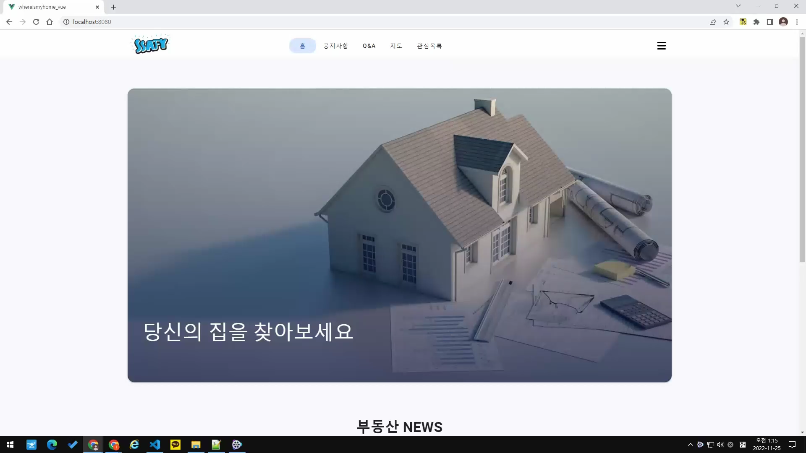

## 팀소개

| 이름 | 역할  |
| :---: | :---: |
| 류한민(팀장) | 프론트엔드, 백엔드  |
| 장지웅 | 프론트엔드, 백엔드 |

---

## 사용한 라이브러리
- vue
- vuex
- vue-router
- axios
- jwt-decode : jwt 토큰 복호화
- vuetify : Material Design(입체감 효과) Framework for Vue.js
- vue-chartjs : 차트 제공
- vuex-persistedstate : 로그인 세션 영속성
- lru-cache : 캐싱 최신화, 일정 크기 이상 캐시 삭제
- v-click-outside : 컴포넌트 외부 입력 감지
- fontawesome : 커스텀 폰트
- mdi/js : Material Design Icon

---
# 기능

## 홈(류한민)
### 부동산 뉴스
- 네이버 API
- 페이지네이션
- (네이버 open api -> 프록시)
- (정규식 사용하여 뉴스 가공)
### 최근 본 목록
- 페이지네이션
- 클릭시 지도에서 아파트 검색
- (LRU-CACHE)
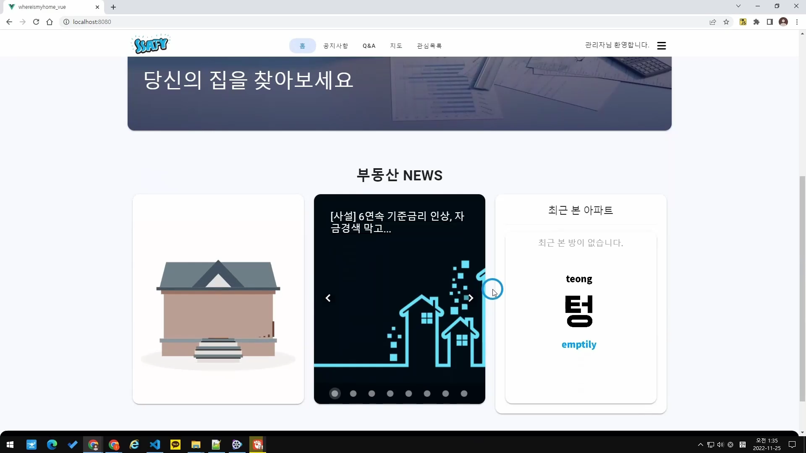

## 공지사항(장지웅)
### CRUD
- 서버사이드 검색(userid == "id", subject like "%id%")
- 서버사이드 페이지네이션(최대 보이는 페이지 7개 제한)
- 리스트, 상세정보 조회(어드민, 일반 유저)
- (클릭 시 상세정보 펼치기 및 조회수 증가)
- 모달에서 글쓰기(어드민)
- 상세정보에서 수정, 삭제(어드민)
- 권한 없으면 버튼 가리기
- 작성시간 당일이면 시간, 다른날이면 날짜로 출력
- 글 쓸때, 작성자를 로그인한 유저로 고정
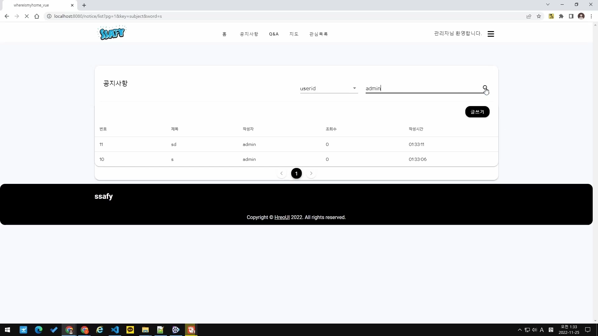

## Q&A(장지웅)
### 답글 기능
- 배경색, 루트 글은 흰색, 이외엔 회색
- 답글의 레벨에 따라 글 제목에 RE:를 계속 붙여줌
- 부모글 삭제 시 자식들 안보임
- 공지사항의 기능 + 일반 유저 글쓰기, 수정 가능
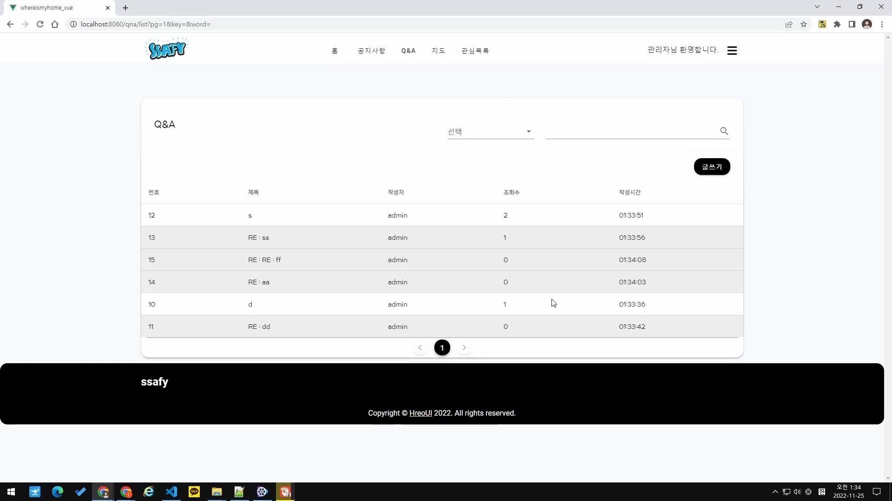

## 지도(류한민, 장지웅)
### 검색(류한민)
- 타입(시, 구군, 동, 아파트)을 기준으로 글자로 검색 가능
- 글자 입력 시, 서치리스트 제공
- 서치리스트에서 아파트 검색 결과 재조회
- 검색 시, 해당 위치로 이동
- 검색 시, 해당 타입에 적합한 지도 확대 레벨로 변환
- 지역으로 검색 시, 해당 지역 아파트만 조회
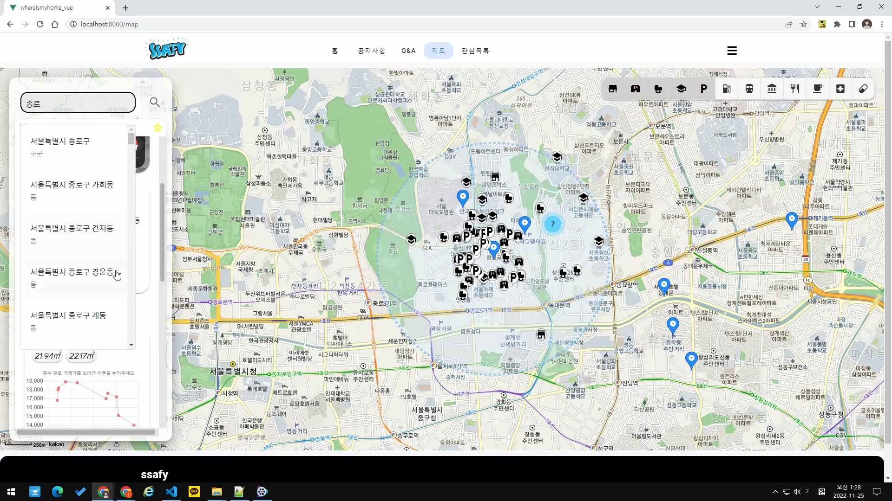

### 아파트 정보(장지웅)
- 아파트 상세정보(아파트명, 주소, 건설년도, 최근 거래가)
- 로드뷰(카카오 API)
- 아파트 면적별로 거래가 추이 차트 제공(거래 없으면 차트 숨김)
- 아파트 면적별 버튼으로 차트 구분
- x축 YYYY.MM 포맷으로 전처리(보기 편하게)
- 차트 내 데이터 호버 시, 해당 거래에 대한 정보(시기, 금액) 제공
### 인프라(류한민)
- 카카오 API 인프라 데이터 수집
- 인프라 버튼 클릭 시 1km 이내의 개별 인프라 위치, 이미지 제공
- 이미지 호버 시, 개별 인프라명 제공
### 레이더 차트(장지웅)
- 인프라 버튼 3개 이상 클릭 시 (1000 - 가장 가까운 인프라의 거리)를 점수로 치환하여 레이더 차트 제공
- 선택한 인프라 평균 점수 제공
- x축 0 ~ 1000 고정(보기 편하게)
- 차트 내 데이터 호버 시, 인프라 이름, 점수 제공
### 아파트 거래 내역(류한민)
- 아파트별 모든 기간 거래내역 제공
- 페이지네이션
### 클러스터링(류한민)
- 맵 확대 레벨별 클러스터링 제공

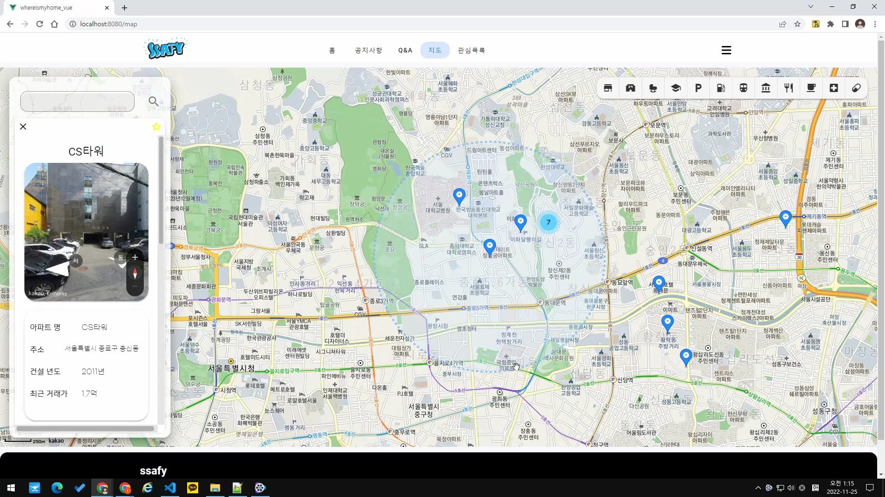
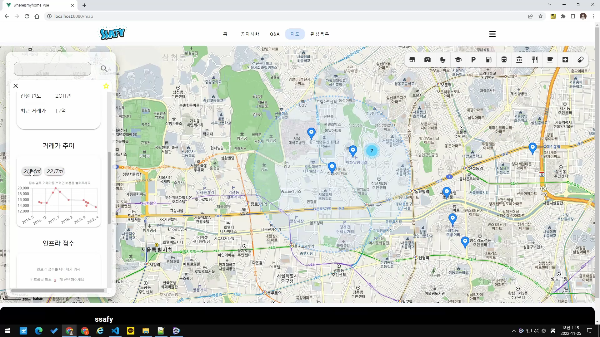
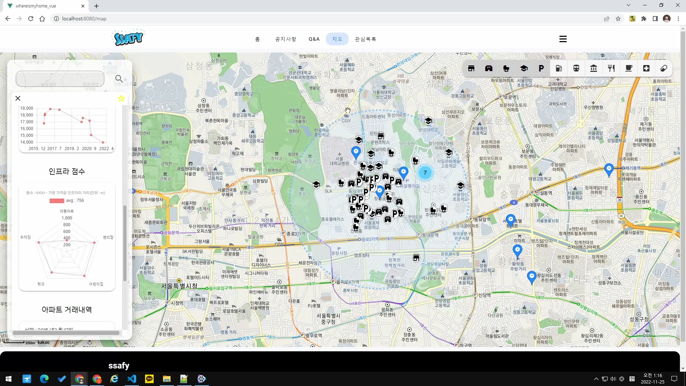
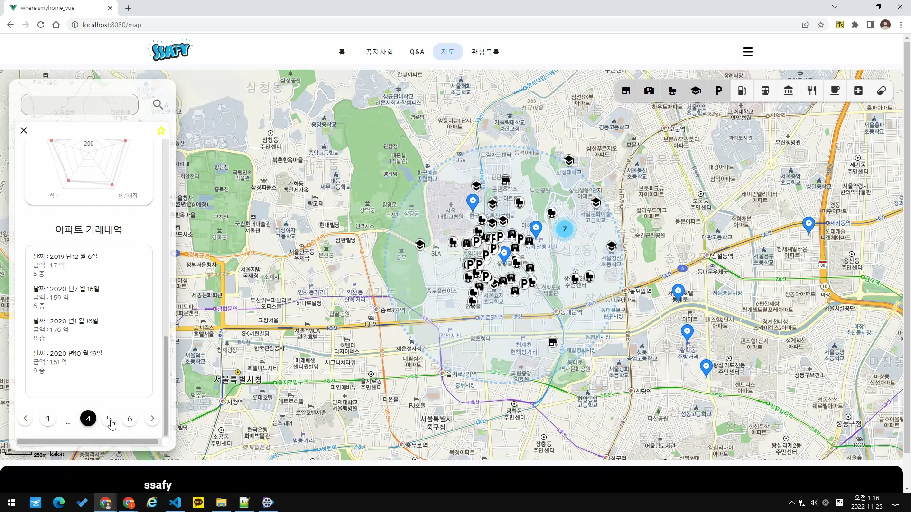
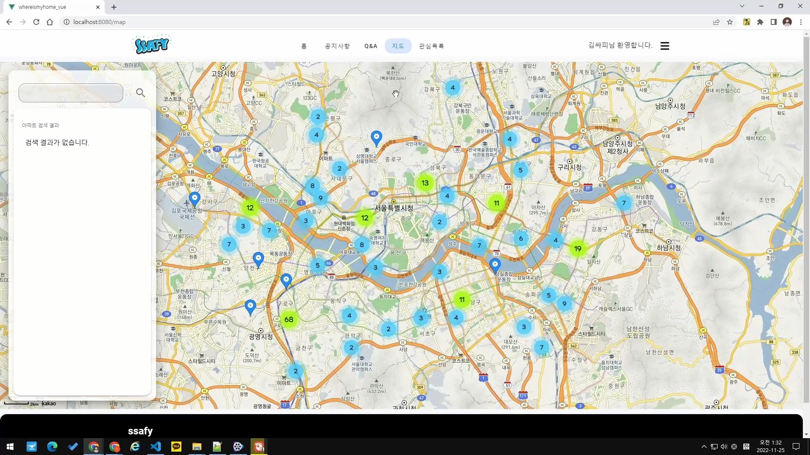

## 관심목록(류한민)
### 즐겨찾기
- 유저별 즐겨찾기 입력, 삭제
- 관심 목록의 찜한 아파트에서 조회 가능
- 라우터를 이용한 중첩 탭
- 최근 본 아파트(홈 화면과 동일한 기능)
- 클릭시 지도에서 아파트 검색
- (LRU-CACHE)
### 찜한 아파트
- 아파트 정보에서 즐겨찾기한 목록 제공
## 멤버(류한민)
- 로그인 여부 확인 가능
- 로그인 시 세션 유지 가능
- jwt로 보안성 강화
- 회원가입, 마이페이지, 수정, 삭제
- 유저별 기능이 필요한 화면에서 로그인 강요하게 만듦
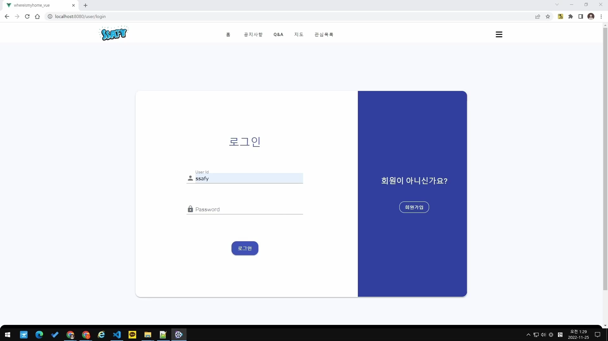